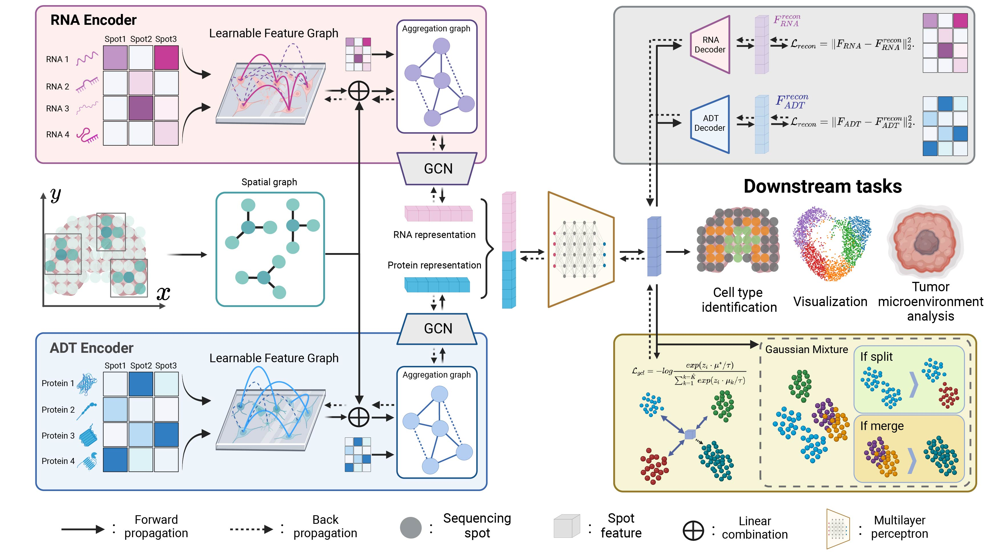

# PRAGA 项目架构说明文档

## 项目概述

PRAGA (PRototype-Aware Graph Adaptative aggregation) 是一个用于空间多模态组学分析的深度学习框架。该项目基于图神经网络和对比学习，能够整合空间转录组学和蛋白质组学数据，实现细胞聚类和空间域识别。



## 核心特性

- 支持双模态和三模态空间组学数据分析
- 基于图神经网络的特征学习
- 原型感知的自适应图聚合机制
- 支持多种数据类型：10x Visium、SPOTS、Stereo-CITE-seq、空间表观转录组等

## 项目结构

```
PRAGA_our/
├── PRAGA/                          # 核心算法模块
│   ├── preprocess.py              # 数据预处理模块
│   ├── preprocess_3M.py           # 三模态数据预处理
│   ├── model.py                   # 神经网络模型定义
│   ├── model_3M.py                # 三模态模型定义
│   ├── Train_model.py             # 双模态训练模块
│   ├── Train_model_3M.py          # 三模态训练模块
│   ├── utils.py                   # 工具函数
│   └── optimal_clustering_HLN.py  # 聚类优化算法
├── Data/                          # 数据目录
│   ├── HLN/                      # 人类淋巴结数据
│   ├── Mouse_Brain/              # 小鼠脑组织数据
│   └── Simulation/               # 仿真数据
├── results/                       # 结果输出目录
├── Pic/                          # 图片资源
├── main.py                       # 主程序入口
├── cal_matrics.py                # 评估指标计算
├── clustering_utils.py           # 聚类工具函数
├── metric.py                     # 评估指标定义
├── run.sh                        # 运行脚本
└── requirements.txt              # 依赖包列表
```

## 核心模块详解

### 1. 主程序模块 (main.py)

**功能**: 程序入口，负责整个流程的调度和参数解析

**主要功能**:
- 命令行参数解析
- 数据加载和预处理调度
- 模型训练和推理
- 结果保存和可视化

**关键参数**:
- `--file_fold`: 数据文件夹路径
- `--data_type`: 数据类型 (10x, SPOTS, Stereo-CITE-seq等)
- `--n_clusters`: 聚类数量
- `--RNA_weight`, `--ADT_weight`: 模态权重

### 2. 数据预处理模块

#### preprocess.py
**功能**: 双模态数据预处理
- 基因过滤和归一化
- 高变基因选择
- PCA降维
- 空间邻接图构建
- 特征邻接图构建

#### preprocess_3M.py  
**功能**: 三模态数据预处理
- 支持RNA + Protein + ATAC数据
- LSI变换(用于ATAC数据)
- 多模态图构建

### 3. 模型架构模块

#### model.py
**功能**: 双模态神经网络模型定义

**核心组件**:
- `Encoder_overall`: 整体编码器
  - 1x1卷积融合空间图和特征图
  - 双模态编码器
  - MLP融合层
- `Encoder`: 单模态图卷积编码器
- `Decoder`: 重构解码器
- `Parametered_Graph`: 可学习的图参数

#### model_3M.py
**功能**: 三模态扩展模型
- 支持RNA + Protein + ATAC三种模态
- 多模态特征融合

### 4. 训练模块

#### Train_model.py
**功能**: 双模态模型训练

**训练策略**:
- 重构损失优化
- 对比学习损失
- 原型感知聚类损失
- 指数移动平均(EMA)更新

**核心算法**:
- 自适应图学习
- 原型更新机制
- 多阶段训练策略

#### Train_model_3M.py
**功能**: 三模态模型训练
- 扩展的损失函数
- 三模态特征对齐

### 5. 工具模块

#### utils.py
**功能**: 通用工具函数
- 聚类算法接口 (mclust, leiden, louvain)
- 特征标准化
- 图构建工具

#### clustering_utils.py
**功能**: 聚类相关工具
- 各种聚类算法实现
- 聚类结果后处理

#### optimal_clustering_HLN.py
**功能**: 优化聚类算法
- R5算法实现
- 聚类质量优化

### 6. 评估模块

#### cal_matrics.py
**功能**: 评估指标计算主程序
- 加载真实标签和预测结果
- 计算各种聚类评估指标

#### metric.py
**功能**: 评估指标定义
- Jaccard系数
- Dice系数  
- F-measure
- 其他自定义指标

## 数据流程

1. **数据加载**: 读取h5ad格式的多模态数据
2. **数据预处理**: 
   - 基因过滤和归一化
   - 降维 (PCA/LSI)
   - 图构建 (空间图和特征图)
3. **模型训练**:
   - 编码器学习特征表示
   - 解码器重构原始数据
   - 原型感知聚类优化
4. **聚类推理**: 基于学习的特征进行聚类
5. **结果评估**: 计算各种聚类质量指标
6. **可视化**: 生成UMAP和空间分布图

## 支持的数据类型

| 数据类型 | 模态组合 | 特点 |
|---------|---------|------|
| 10x | RNA + Protein | 标准10x Visium数据 |
| SPOTS | RNA + Protein | SPOTS技术数据 |
| Stereo-CITE-seq | RNA + Protein | 高分辨率空间数据 |
| Spatial-epigenome-transcriptome | RNA + ATAC | 空间表观转录组 |
| Simulation | RNA + Protein + ATAC | 三模态仿真数据 |

## 核心算法特点

1. **自适应图学习**: 动态学习最优的图结构
2. **原型感知聚类**: 基于原型的对比学习
3. **多模态融合**: 有效整合不同组学数据
4. **空间约束**: 考虑细胞的空间邻近关系

## 运行环境

- Python 3.8+
- PyTorch 2.0+
- scanpy, anndata
- scikit-learn
- 详见 requirements.txt

## 快速开始

```bash
# 安装依赖
pip install -r requirements.txt

# 运行示例
sh run.sh

# 自定义运行
python main.py --file_fold ./Data/HLN --data_type 10x --n_clusters 7 --init_k 10
```

## 输出结果

- **聚类标签**: `results/XXX.txt`
- **可视化图**: `results/XXX.png` 
- **评估指标**: `results/XXX_metrics.txt`

这个项目为空间多模态组学分析提供了完整的端到端解决方案，具有良好的扩展性和实用性。